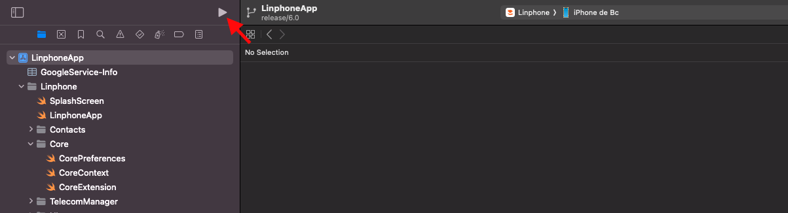
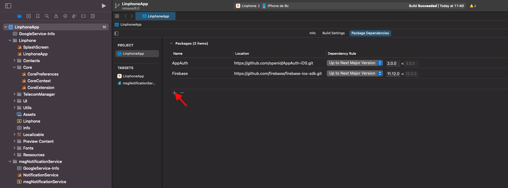
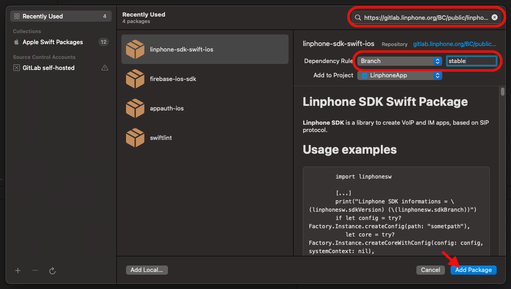
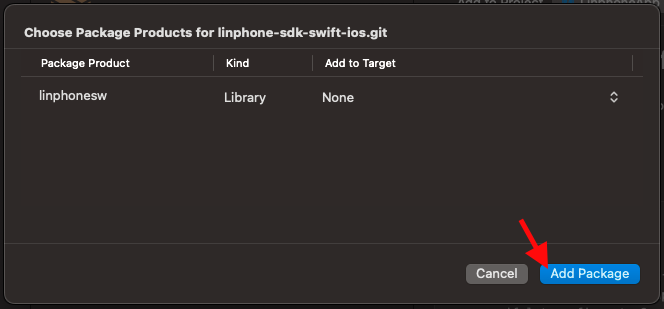
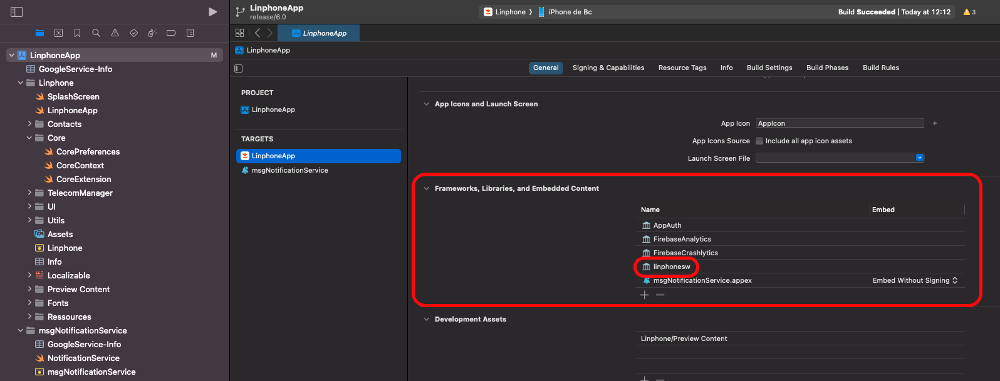
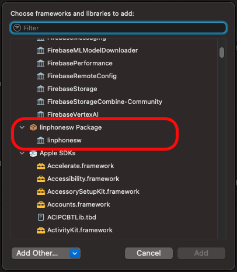
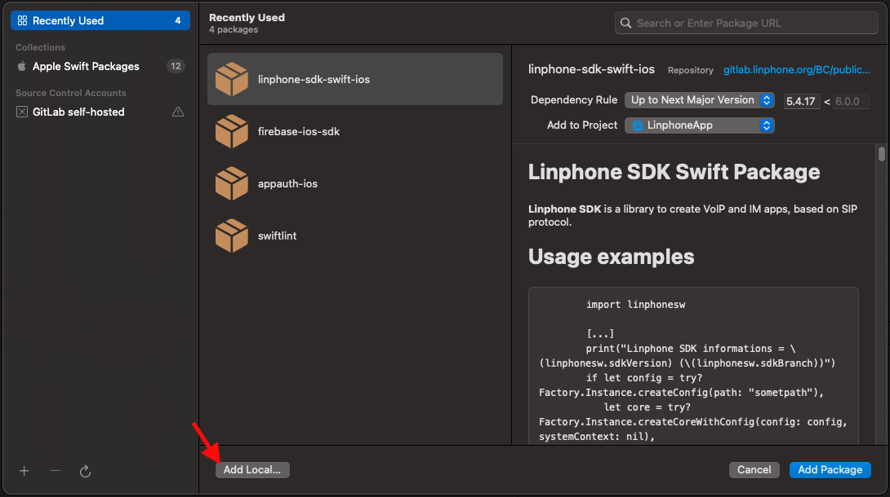
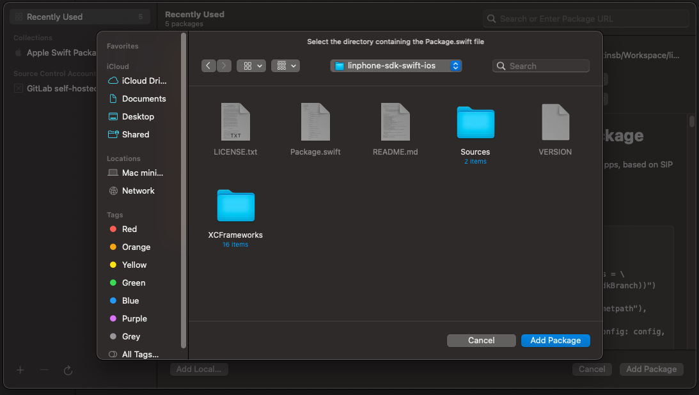

Linphone is an open source softphone for voice and video over IP calling and instant messaging. It is fully SIP-based, for all calling, presence and IM features.
General description is available from [linphone web site](https://www.linphone.org/technical-corner/linphone)

## License

Copyright © Belledonne Communications

Linphone is dual licensed, and is available either :
- under a [GNU/GPLv3](https://www.gnu.org/licenses/gpl-3.0.en.html) license, for free (open source). Please make sure that you understand and agree with the terms of this license before using it (see LICENSE file for details).
- under a proprietary license, for a fee, to be used in closed source applications. Contact [Belledonne Communications](https://www.linphone.org/contact) for any question about costs and services.

## Documentation

- Supported features and RFCs : https://www.linphone.org/technical-corner/linphone/features
- Linphone public wiki : https://wiki.linphone.org/xwiki/wiki/public/view/Linphone/


# How can I contribute?

Thanks for asking! We love pull requests from everyone. Depending on what you want to do, you can help us improve Linphone in
various ways:

## Help on translations

We no longer use transifex for the translation process, instead we have deployed our own instance of [Weblate](https://weblate.linphone.org/projects/linphone/).

Due to the full app rewrite we can't re-use previous translations, so we'll be very happy if you want to contribute.

## Report bugs and submit patchs

If you want to dig through Linphone code or report a bug, please read `CONTRIBUTING.md` first. You should also read this `README` entirely ;-).

## How to be a beta tester ?

Enter the Beta :
- Download TestFlight from the App Store and log in it with your apple-id
- Tap the public link on your iOS device. The public link : https://testflight.apple.com/join/LUlmZWjH
- Touch View in TestFlight or Start Testing. You can also touch Accept, Install, or Update for Linphone app.
- And voilà ! You can update your beta version with the same public link when a new one is available

Send a crash report :
 - It is done automatically by TestFlight

Report a bug :
 - Open Linphone
 - Go to Settings —> Advanced —> Send logs
 - An email to linphone-iphone@belledonne-communications.com is created with your logs attached
 - Fill in the bug description with :
	* What you were doing
	* What happened
	* What you were expecting
	* Approximately when the bug happened
 - Change the object to [Beta test - Bug report]
 - Send the mail

# Building the application

## What's new

With Linphone 6.0, we are switching to Swift Package Manager.  
By default, the app uses a remote SPM repository: https://gitlab.linphone.org/BC/public/linphone-sdk-swift-ios.git  
However, if you wish to use a locally built SDK, please refer to the section “Using a local Linphone SDK” below for instructions.

## Building the app

Open `linphone.xcodeproj` with Xcode to build and run the app.  
The remote SPM is already configured in the app.



# Using a remote Linphone SDK (Optional)

If you want to switch the dependencies back to the remote SPM, here’s how to proceed:

- Go to the Package Dependencies section of your project.



- In the top-right corner of the screen, enter the following URI: https://gitlab.linphone.org/BC/public/linphone-sdk-swift-ios.git
- Change the Dependency Rule to Branch, and enter the keyword stable.
- Click Add Package.



- A new page will open to let you add targets to the library. Normally, this is not necessary, as the dependencies on Linphone and msgNotificationService should already be present.
- Click Add Package.



- Make sure the library appears in the Frameworks, Libraries, and Embedded Content section of all targets that need it.



- Add it manually if needed.



# Using a local linphone SDK (Optional)

- Clone the linphone-sdk repository from our GitLab:
```
git clone git@gitlab.linphone.org:BC/public/linphone-sdk.git
git submodule update --init --recursive
```

- Build the SDK:
```
cmake --preset=ios-sdk -G Ninja -B spm-ios && cmake --build spm-ios
```

- Go to the Package Dependencies section of your project (remove the remote linphonesw SPM from the package dependencies if necessary)


- Click on Add Local.



- Follow your path: yourSdkPath/linphone-sdk/spm-ios/linphone-sdk-swift-ios



- A new page will open to let you add targets to the library. Normally, this is not necessary, as the dependencies on Linphone and msgNotificationService should already be present.
- Click Add Package.


- Make sure the library appears in the Frameworks, Libraries, and Embedded Content section of all targets that need it.


- Add it manually if needed.


