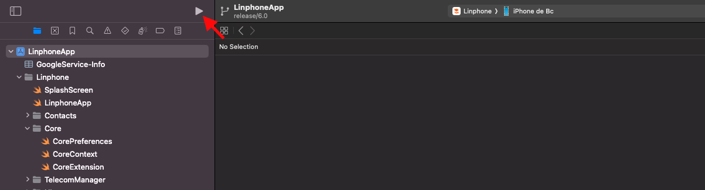
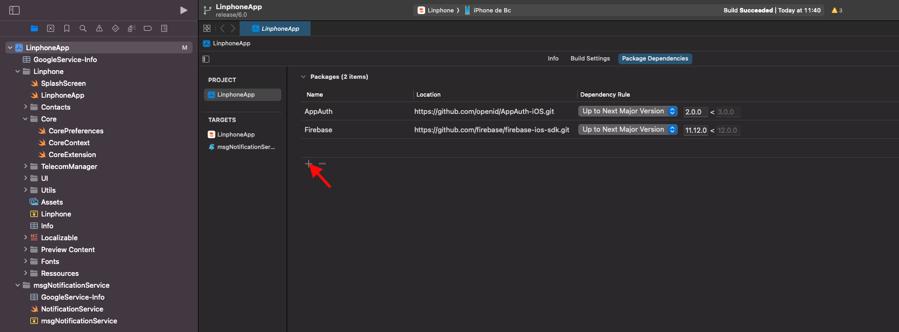
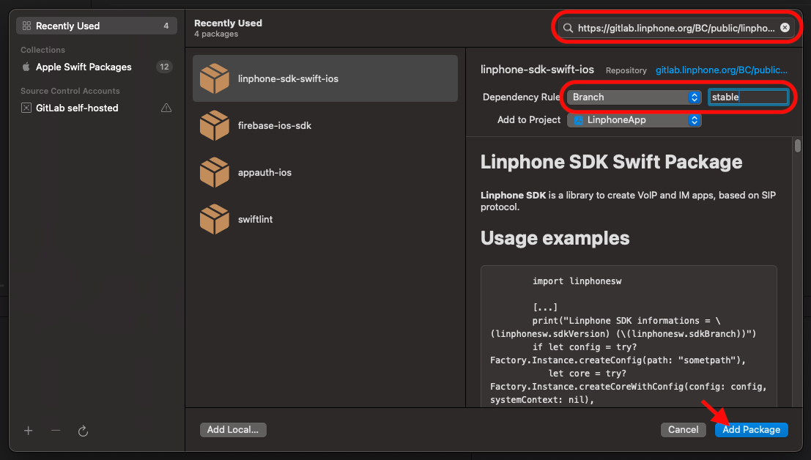
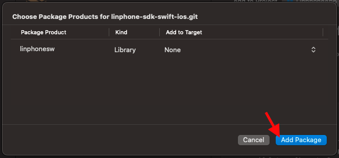
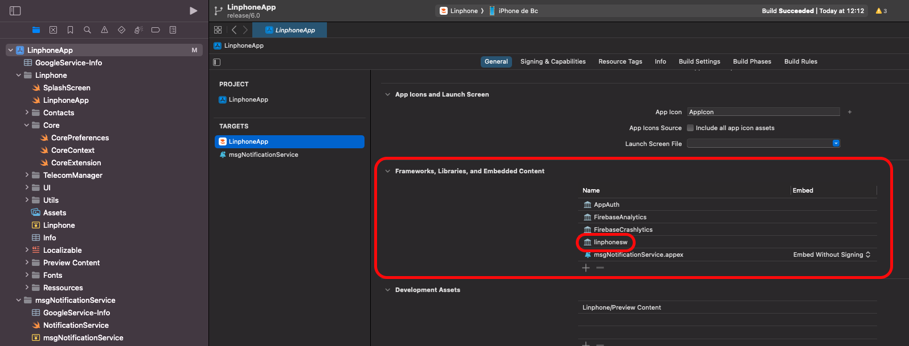
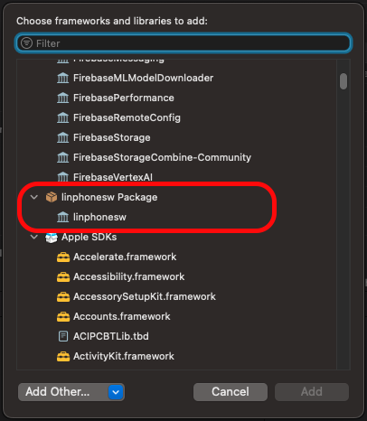
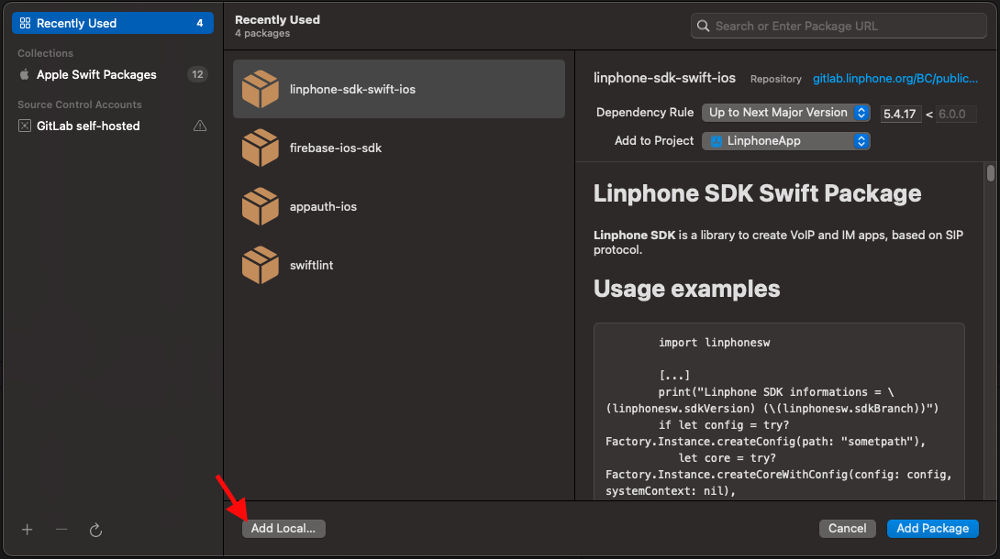
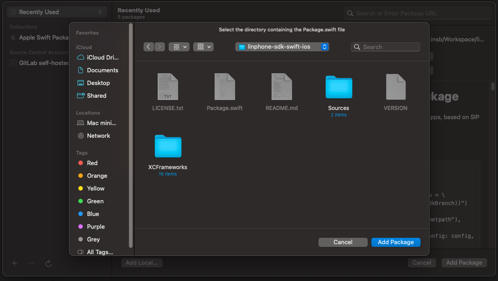

Linphone is an open source softphone for voice and video over IP calling and instant messaging. It is fully SIP-based, for all calling, presence and IM features.
General description is available from [linphone web site](https://www.linphone.org/technical-corner/linphone)

## License

Copyright © Belledonne Communications

Linphone is dual licensed, and is available either :
- under a [GNU/GPLv3](https://www.gnu.org/licenses/gpl-3.0.en.html) license, for free (open source). Please make sure that you understand and agree with the terms of this license before using it (see LICENSE file for details).
- under a proprietary license, for a fee, to be used in closed source applications. Contact [Belledonne Communications](https://www.linphone.org/contact) for any question about costs and services.

## Documentation

- Supported features and RFCs : https://www.linphone.org/technical-corner/linphone/features
- Linphone public wiki : https://wiki.linphone.org/xwiki/wiki/public/view/Linphone/


# How can I contribute?

Thanks for asking! We love pull requests from everyone. Depending on what you want to do, you can help us improve Linphone in
various ways:

## Help on translations

We no longer use transifex for the translation process, instead we have deployed our own instance of [Weblate](https://weblate.linphone.org/projects/linphone/).

Due to the full app rewrite we can't re-use previous translations, so we'll be very happy if you want to contribute.

## Report bugs and submit patchs

If you want to dig through Linphone code or report a bug, please read `CONTRIBUTING.md` first. You should also read this `README` entirely ;-).

## How to be a beta tester ?

Enter the Beta :
- Download TestFlight from the App Store and log in it with your apple-id
- Tap the public link on your iOS device. The public link : https://testflight.apple.com/join/LUlmZWjH
- Touch View in TestFlight or Start Testing. You can also touch Accept, Install, or Update for Linphone app.
- And voilà ! You can update your beta version with the same public link when a new one is available

Send a crash report :
 - It is done automatically by TestFlight

Report a bug :
 - Open Linphone
 - Go to Settings —> Advanced —> Send logs
 - An email to linphone-iphone@belledonne-communications.com is created with your logs attached
 - Fill in the bug description with :
	* What you were doing
	* What happened
	* What you were expecting
	* Approximately when the bug happened
 - Change the object to [Beta test - Bug report]
 - Send the mail

# Building the application

## What's new

With Linphone 6.0, we are switching to Swift Package Manager.  
By default, the app uses a remote SPM repository: https://gitlab.linphone.org/BC/public/linphone-sdk-swift-ios.git  
However, if you wish to use a locally built SDK, please refer to the section “Using a local Linphone SDK” below for instructions.

## Building the app

Open `linphone.xcodeproj` with Xcode to build and run the app.  
The remote SPM is already configured in the app.



# Using a remote Linphone SDK (Optional)

If you want to switch the dependencies back to the remote SPM, here’s how to proceed:

- Go to the Package Dependencies section of your project.



- In the top-right corner of the screen, enter the following URI: https://gitlab.linphone.org/BC/public/linphone-sdk-swift-ios.git
- Change the Dependency Rule to Branch, and enter the keyword stable.
- Click Add Package.



- A new page will open to let you add targets to the library. Normally, this is not necessary, as the dependencies on Linphone and msgNotificationService should already be present.
- Click Add Package.



- Make sure the library appears in the Frameworks, Libraries, and Embedded Content section of all targets that need it.



- Add it manually if needed.



# Using a local linphone SDK (Optional)

- Clone the linphone-sdk repository from our GitLab:
```
git clone git@gitlab.linphone.org:BC/public/linphone-sdk.git
git submodule update --init --recursive
```

- Build the SDK:
```
cmake --preset=ios-sdk -G Ninja -B spm-ios && cmake --build spm-ios
```

- Go to the Package Dependencies section of your project (remove the remote linphonesw SPM from the package dependencies if necessary)


- Click on Add Local.



- Follow your path: yourSdkPath/linphone-sdk/spm-ios/linphone-sdk-swift-ios



- A new page will open to let you add targets to the library. Normally, this is not necessary, as the dependencies on Linphone and msgNotificationService should already be present.
- Click Add Package.


- Make sure the library appears in the Frameworks, Libraries, and Embedded Content section of all targets that need it.


- Add it manually if needed.


# MDM (Mobile Device Management) configuration

Linphone iOS supports managed app configuration via the standard iOS MDM
`com.apple.configuration.managed` mechanism. When the app is deployed through
an MDM server, administrators can push a configuration dictionary that the app
reads at startup and whenever the managed configuration changes at runtime.

The following keys are supported:

| Key           | Type   | Description                                                                                     |
|---------------|--------|-------------------------------------------------------------------------------------------------|
| `xmlConfig`  | String | A Linphone configuration in XML format (same schema as `linphonerc`). Applied via `Config.loadFromXmlString`. |
| `rootCa`     | String | A PEM-encoded root CA certificate used by the Linphone SDK for TLS operations (SIPS, HTTPS provisioning, …). Applied to `core.rootCaData`. |
| `configUri`  | String | URI to a remote provisioning file. When set, it takes precedence over any `config-uri` that may be defined inside `xmlConfig`, and triggers a core restart to fetch the remote configuration. |

Notes:
- All three keys are optional and can be combined.
- If `configUri` is present, it is set last and the core is restarted so that
  remote provisioning takes effect; any `config-uri` value embedded in
  `xmlConfig` is therefore overridden.
- Applying and removing the managed configuration at runtime is supported:
  removing it resets the core to its default configuration and returns to the
  assistant/login screen.

## Testing MDM configuration

Two kinds of tests are provided:

### UI tests (end-to-end)

Located in `LinphoneAppUITests/MDMChatFeatureUITests.swift`. They inject a
managed configuration at launch via the app's DEBUG-only
`UITEST_MDM_CONFIG` launch-environment hook (implemented in
`Linphone/LinphoneApp.swift`), so no `xcrun simctl` setup is needed.

Note: the tests only cover MDM *application* (fresh launch with a managed
config). Live removal of MDM while the app is running cannot be simulated
from an XCUITest process (UserDefaults is per-process and we want the app
to stay alive for a realistic removal scenario), so that path is covered by
manual testing only.

Each MDM test case represents "a fresh device receiving a specific managed
configuration", so we uninstall the app before every test to avoid any
leakage of UserDefaults / keychain / provisioning / accounts between cases.
The wrapper script `scripts/run-mdm-tests.sh` does this for you.

The tests need a real SIP account to reach the main screen (the MDM XML
embeds proxy + auth_info sections) and a remote provisioning URL for the
configUri test. Credentials can be provided three ways — the script
resolves them in this order, highest first:

1. CLI flags: `--username`, `--ha1`, `--domain`, `--configUri` (and
   `--device` for the sim UUID)
2. Shell env vars: `LINPHONE_TEST_USERNAME`, `LINPHONE_TEST_HA1`,
   `LINPHONE_TEST_DOMAIN`, `LINPHONE_TEST_CONFIG_URI`
3. The gitignored file `scripts/test-credentials.env` (copy from `.env.example`)

Examples:

```bash
scripts/run-mdm-tests.sh --device <uuid> --username alice --ha1 <md5-hash> --configUri https://example.com/provisioning.xml
```

```bash
cp scripts/test-credentials.env.example scripts/test-credentials.env
# edit scripts/test-credentials.env, fill in LINPHONE_TEST_USERNAME /
# LINPHONE_TEST_HA1 / LINPHONE_TEST_CONFIG_URI
scripts/run-mdm-tests.sh
```

It will create+boot a throwaway simulator if `DEVICE_UUID` is not set,
uninstall the app before each test, run the tests one at a time with
`-parallel-testing-enabled NO`, and clean up at the end. To reuse an
already-booted simulator:

```bash
DEVICE_UUID=<your-booted-simulator-uuid> scripts/run-mdm-tests.sh
```

`-parallel-testing-enabled NO` avoids flaky UI test launch failures caused by
Xcode spinning up multiple simulator clones in parallel (the test-runner app
can fail to launch on a clone under pressure).

Covered cases:
- `testChatButtonHiddenWithMDMDisableChat` — MDM `xmlConfig` with
  `disable_chat_feature=1`; the test reaches the main screen and asserts the
  chat button is hidden.
- `testConfigUriMDMLandsOnMainPage` — MDM `configUri` pointing at the URL
  supplied via `--configUri` / `LINPHONE_TEST_CONFIG_URI`; the test verifies
  that remote provisioning completes and the app lands on the main screen.

### Unit tests (MDMManager)

Located in `LinphoneAppTests/MDMManagerTests.swift`. The unit test covers
only `rootCa` application: it calls
`MDMManager.shared.applyMdmConfigToCore(core:)` directly on a throwaway
`Core` and asserts `core.rootCaData` matches the MDM-provided certificate.
The `configUri` and `xmlConfig` paths are exercised end-to-end by the UI
tests above.

This requires a **Unit Testing Bundle** target in Xcode (separate from the UI
test target, because `@testable import Linphone` only works from a unit test
bundle):

1. Xcode → File → New → Target → iOS → Unit Testing Bundle
2. Name it `LinphoneAppTests`, set "Target to be Tested" to `LinphoneApp`
3. Add `LinphoneAppTests/MDMManagerTests.swift` to that target

Then run:

```bash
xcodebuild test -project LinphoneApp.xcodeproj -scheme LinphoneAppTests -destination "platform=iOS Simulator,id=$DEVICE_UUID"
```
